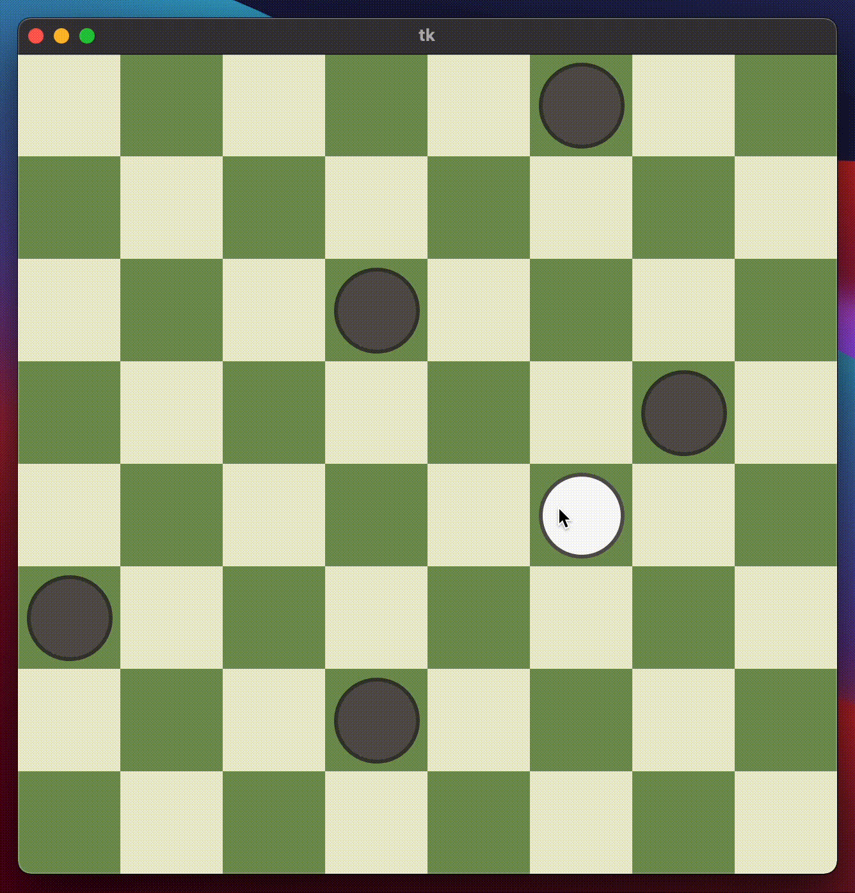

# Checkers

An implementation of Checkers, also known as Draughts, with Python and Tkinter.

## Installation

In order to play, git clone this repository and run main.py. Make sure you have installed Python and Tkinter.

## Rules

In this implementation, the rules of Russian draughts were used. You can read them [here](https://en.wikipedia.org/wiki/Russian_draughts#Rules). Kings are displayed as pieces with the letter 'K' on them.

## Demo

